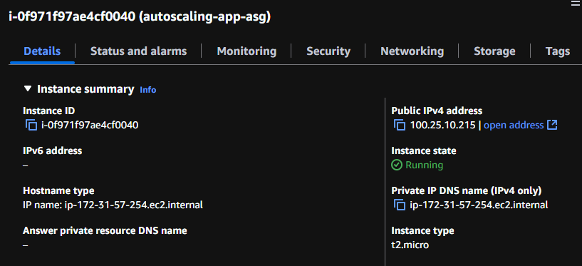
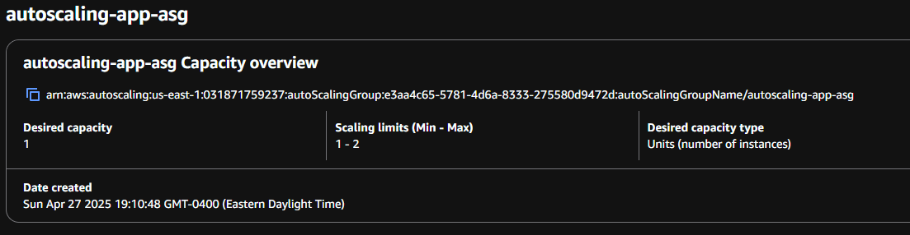
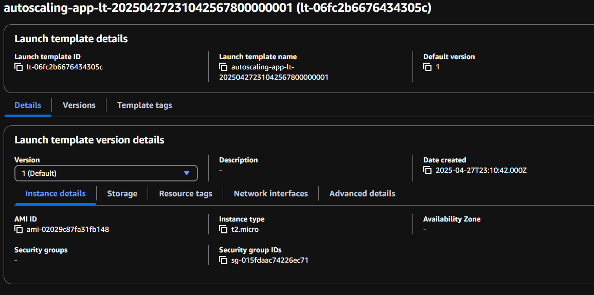
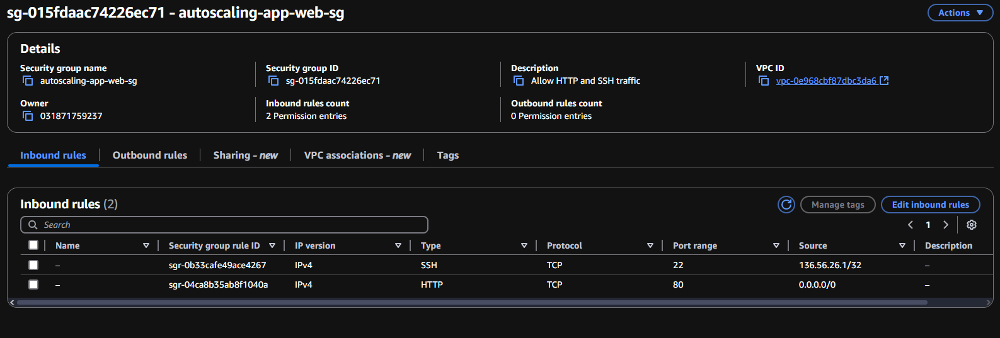
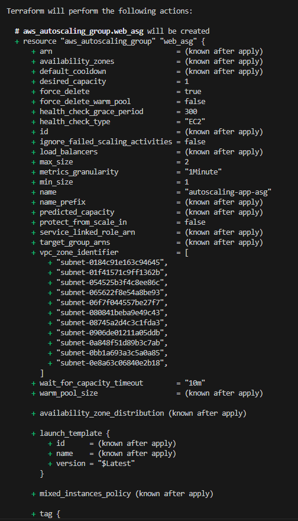
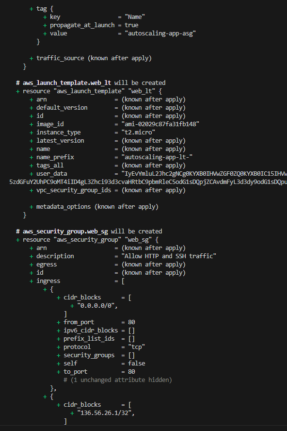
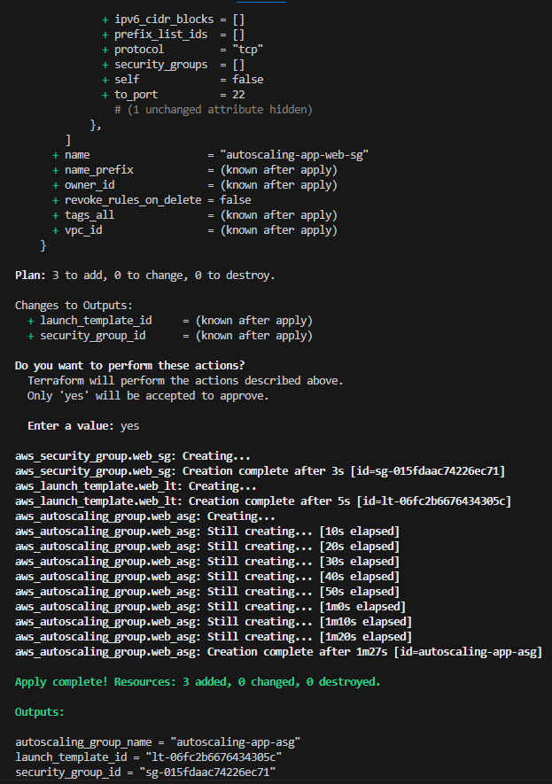

# Terraform EC2 Auto Scaling Project

This project provisions a fully functional EC2 Auto Scaling Group on AWS using Terraform.  
It deploys Ubuntu servers running a basic Python web server and manages scaling policies for high availability.

---

## Stack:

- Terraform
- AWS EC2
- AWS Auto Scaling Groups
- AWS Launch Templates
- AWS Security Groups
- AWS IAM
- AWS VPC and Subnets
- GitHub

## Features:

- Creates an EC2 launch template
- Deploys an Auto Scaling Group
- Configures a security group allowing HTTP and limited SSH
- Installs and runs a Python web server at boot
- Tags all infrastructure for easy management
- Outputs key resource information after deployment

---

## Live Preview:

If deployed, it can be accessed at its public IP address on port **80**.

[Live Page](http://100.25.10.215)

---

## Screenshots

## Screenshots

### EC2 Instance

### Auto Scaling Group

### Launch Template

### Security Group

### Terraform Apply - Terminal Output
**Terraform Plan and Apply Process:**

---

## Find Me Here

Collin Belik – [LinkedIn](https://www.linkedin.com/in/collin-belik/)
